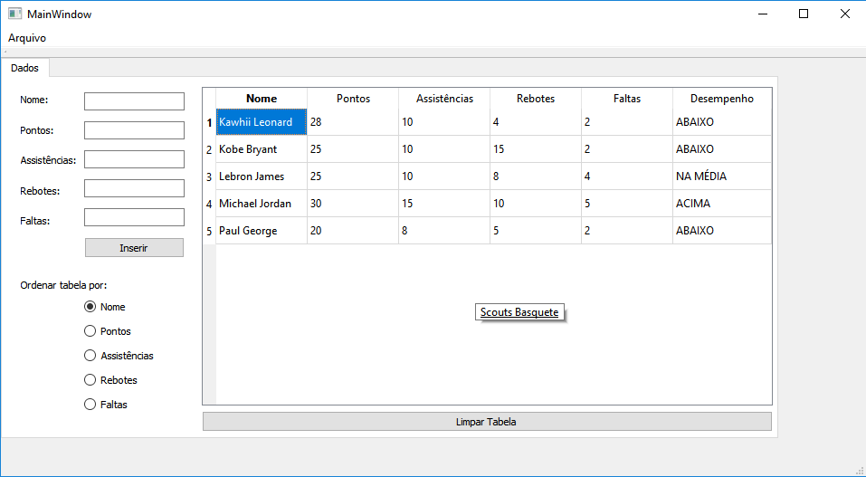

# Project_Scouts
### Project_Scouts é uma aplicação que cadastra as estatísticas de jogo após uma partida de basquete, as organiza em uma tabela e retorna o desempenho do jogador com base na média de desempenho da equipe na partida.
Este software permite que o usuário cadastre as estatísticas obtidas após uma partida de basquete.

# Manual do usuário
### No Project_Scouts você encontrará um layout de fácil interpretação, o que possibilitará total comodidade ao usuário que deseja analisar o desempenho de sua equipe no decorrer de um campeonato, por exemplo! Entretanto, como um bom aplicativo, estabelecemos o compromisso de assegurar sua comodidade do início ao fim, sendo assim, proporcionamos um guia de instruções para facilitar sua experiência mais ainda em nosso app!
### Como começar?
Fácil! Insira os dados pedidos na tela inicial. Clicando no botão "Inserir" ele vai ser automaticamente inserido na tabela, onde terá seu desempenho calculado. Como exemplo, usaremos o jogador Lebron James.

Pronto. Agora é só inserir os dados na tabela!

Após a inserção dos dados do seu atleta já podemos observar qual seu desempenho durante a partida! Vale salientar que o desempenho do jogador é calculado com base no número de atletas inserido na tabela. Vejamos a seguir:

### Gostaria de ordenar seus dados?
Você é um usuário organizado e gostaria de ordenar sua tabela? Nosso app faz isso pra você! Como gostaria de ordenar? Por nome? Número de pontos? Assistências? Faltas ou Rebotes? Não importa! Sinta-se a vontade para escolher.
### Como ordenar?
Para ordenar a tabela basta selecionar o rádioButton de sua preferência e VOILA! Aí está sua tabela ordenada como de sua preferência. (Observe o exemplo abaixo).

### Errei ao inserir um dos dados. Como posso alterar?
Simples! Para alterar qualquer dado inserido, basta clicar duas vezes no dado, selecionar "Yes", alterar a informação e selecionar "OK". Vejamos:

### Não quero mais inserir, posso apagar?
Sim, para isso, basta clicar no botão "Limpar tabela" e está feito. Veja:

### Finalizei por hoje. Como salvar?
Para salvar, basta selecionar o campo "Arquivo", em seguida "Salvar" e por fim nomear seu arquivo. Simples não? Veja:

### Não conclui meu projeto mas salvei os dados. Como prosseguir?
Assim como salvar, basta selecionar o campo "Arquivo", em seguida "Carregar" e por fim selecionar seu arquivo para abrir. Vejamos:

Bom, é isso. Chegamos ao fim! Espero que goste da sua experiência em nosso aplicativo. Estaremos trabalhando para melhorar nosso app e estamos abertos ao seu feedback!
### Obrigado!
